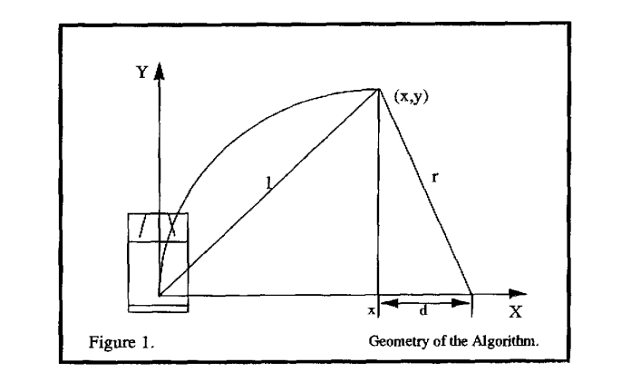

# Reference
[scottpletcher-v1-PurePursuit](https://github.com/scottpletcher/deepracer/blob/master/iterations/v1-PurePursuit.md)

# What is pure pursuit?
Pure pursuit is a tracking algorithm that works by calculating the curvature that will move a vehicle from its current position to some goal position. The whole point of the algorithm is to choose a goal
position that is some distance ahead of the vehicle on the path. 

# Theoretical Derivation

The pure pursuit approach is a method of geometrically determining the curvature that will drive the vehicle to a chosen path point, termed the goal point. 
This goal point is a point on the path that is one ***lookahead distance*** from the current vehicle position. 
An arc that joins the current point and the goal point is constructed. The chord length of this arc is the lookahead distance, and acts as the third constraint in determining a unique arc that joins the two points. 
Consider the lookahead distance to be analogous to the distance to a spot in front of a car that a human driver might look toward to track the roadway. 




- goal point: The point (x,y), which is one lookahead distance 1 from the origin, is also shown. 
- lookahead distance： l

## The objective 
The objective is to calculate the curvature of the arc that joins the origin to (x,y) and whose chord length is l

## two equations


$$x^2 +y^2= l^2$$
$$x+d =r$$
Equation (2.1) describes the circle of radius 1 about the origin. This is the locos of possible goal points for the vehicle. 
Equation (2.2) describes the relatioaship between the radius of the arc that joins the origin and the goal point, add the x offset of the goal point from the vehicle. The equation simply states that the radius of the arc and the x offset are independent and differ by d 


- x location in global coordinates.
- y location in global coordinates.
- heading in global coordinates.
- curvature of the path at this point.
- distance (dong a stright line) of this point from the beginning of the path.


## Pursuit Algorlthm
The implementation of the pure pursuit algorithm itself is fairly straightforward. The pure pursuit algorithm can be outlined as follows:
- Determine the anent location of the vehicle.
- Find the path point closest to the vehicle.
- Find the goal point
- Transform the goal pohl to vehicle coordinates.
- Calculate the curvature and request the vehicle to set the steering to that curvature.
- Update the vehicle’s position. 


## reward_function
```python
import math


def reward_function(params):
  #  on_track, x, y, distance_from_center, car_orientation, progress, steps,
  #                   throttle, steering, track_width, waypoints, closest_waypoints
      # Read input variables
    x= params['x']
    y = params['y']
    waypoints = params['waypoints']
    closest_waypoints = params['closest_waypoints']
    heading = params['heading']

    
    reward = 1e-3
    
    rabbit = [0,0]
    pointing = [0,0]
        
    # Reward when yaw (car_orientation) is pointed to the next waypoint IN FRONT.
    
    # Find nearest waypoint coordinates
    
    # Calculate the direction of the center line based on the closest waypoints
    next_point = waypoints[closest_waypoints[1]]
    # prev_point = waypoints[closest_waypoints[0]]

    rabbit = next_point
    
    radius = math.hypot(x - rabbit[0], y - rabbit[1])
    
    pointing[0] = x + (radius * math.cos(math.radians(heading)))
    pointing[1] = y + (radius * math.sin(math.radians(heading)))
    
    vector_delta = math.hypot(pointing[0] - rabbit[0], pointing[1] - rabbit[1])
    
    # Max distance for pointing away will be the radius * 2
    # Min distance means we are pointing directly at the next waypoint
    # We can setup a reward that is a ratio to this max.
    
    if vector_delta == 0:
        reward += 1
    else:
        reward += ( 1 - ( vector_delta / (radius * 2)))

    # Reduce reward if car is driving too slow
    if speed < 1.0:
        reward = reward * 0.8
    

    return reward
```

## Parameters


| Hyperparameter | Value |
|----------------|-------|
| Gradient descent batch size | 64 | 
| Entropy | 0.01 |
| Discount Factor | 0.95 | 
| Loss Type | Huber |
| Learning Rate | 0.0003 | 
| Number of experience episodes between each policy-updating iteration | 20 |
| Number of epochs | 10 |

The training configuration was:

| Setting | Value |
|---------|-------|
| Race type | Time trial |
| Environment Simulation | Jennens Family Speedway |
| Sensor(s) | Camera |
| Action space type | Continuous |
| Speed | [ 0.5 : 2 ] m/s |
| Steering angle | [ -30 : 30 ] ° |
| Framework | Tensorflow |
| Reinforcement learning algorithm | PPO |
| Training time | 1 hour |

## Observations
